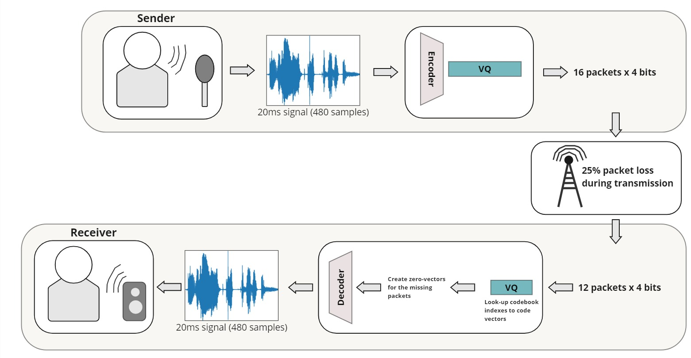
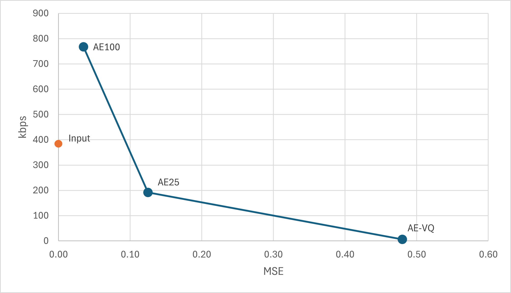

# Vector quantization (VQ)–based generative DNN models for low delay speech and audio coding.

This is a Master's Thesis for the last semester of the Master's Programme In Computer Engineering (AI, Vision, and Sound) at Aalborg University.

## Author
- Lukas Bisgaard Kristensen

## Supervisors
- Jan Østergaard
- Mohammad Bokaei

## Installing

Installing the packages required:
```pip install -r requirements.txt```

## Dataset

The dataset used for running the models is the LibriTTS corpus (cleaned), which can be accessed through the link https://openslr.org/60/.

## Structure

The models folder contains three different models (AE100, AE25, and AE-VQ) and a main.py, which gathers information about the dataset.

## Results
For each model and packet loss variation, a sample was plotted together with a sample that can be played compared to the ground truth and can be seen in the [Results](Results) folder.
The baseline performance for the models without packet loss can be seen in the image below:\
<br>

